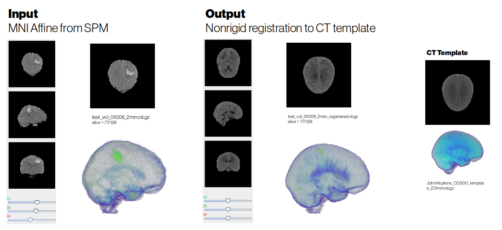

# voxelmorph

This is for the _"MICCAI diffeomorphic model"_, i.e. still have to use Tensorflow (June 2020)

For original notes on this repository see [https://github.com/voxelmorph/voxelmorph](https://github.com/voxelmorph/voxelmorph) 

## SETUP

1) Export your `voxelmorph path`, e.g.
 
   `export PYTHONPATH=$PYTHONPATH:.../voxelmorph/ext/neuron/:.../voxelmorph/ext/pynd-lib/:.../voxelmorph/ext/pytools-lib/` 

2) The original repo only has MRI atlases so we have couple of options now, easiest to use the template from John Hopkins [https://github.com/muschellij2/high_res_ct_template](https://github.com/muschellij2/high_res_ct_template) created from the Qure500 dataset. Original template resolution (`JohnHopkins_CQ500_template_0.5mm.nii.gz` in this repo, and `template.nii.gz` in original Hopkins repo) was 0.5 mm^3, and it was now downsampled with `[resample_template.py](resample_template.py)` to 1.0 mm^3 to `JohnHopkins_CQ500_template_1.0mm.nii.gz`. As well as to 2.00 mm^3 which might be your only option on home/consumer-GPU as the 1.00 mm^3 training won't work with 8GB of GPU RAM.
 
3) This repo reads volumes from `.npz`s rather than from `nii.gz`s directly, thus there is a little tool to do the conversion: `[convert_niftis_to_npz.py](convert_niftis_to_npz.py)`. That now converts only mask at once, TODO! update to include all the masks if you need the masks as .npzs as well   

## TRAINING

4) Start training with `[src/train_CT_sCROMIS2ICH.py](src/train_CT_sCROMIS2ICH.py)`, e.g. with the following command:

`python train_CT_sCROMIS2ICH.py /home/petteri/Dropbox/manuscriptDrafts/CThemorr/DATA_DVC/sCROMIS2ICH/CT/labeled/MNI_2mm_128vx-3D/data/BM4D_brainWeighed_nonNaN_-100_npz --gpu 0` 

And by default the model with continue training from pre-trained model `[models/sCROMIS2ICH_2mm_128vx.h5](sCROMIS2ICH_2mm_128vx.h5)` and you can set its default argument to `None` if you wish to start from scratch. 

That model (at 2 mm^3 resolution) was terminated to (all 209 volumes being in the training split):

`loss: 8.6873 - spatial_transformer_1_loss: 0.8157 - concatenate_5_loss: 7.8716` 

After ~800 epochs at `lr`=1e-4, ~250 epochs at `lr`=1e-5, ~100 epochs at `lr`=1e-6, and could be probably fine-tuned a bit but maybe not too much with a `LR Scheduler` and some ensembling.  

## INFERENCE

Image pairs (input data vs. template) are registered with the `register.py`, e.g. 

`python register.py --gpu 0 ../data/test_vol_01006_2mm.nii.gz ../data/JohnHopkins_CQ500_template_2.0mm_norm.nii.gz --out_img ../data/test_vol_01006_2mm_registered.nii.gz --model_file ../models/sCROMIS2ICH_2mm_128vx.h5 --out_warp ../data/test_vol_01006_2mm_warp_field.nii.gz`

or cleaner with the default files

`python register.py --gpu 0 ../data/test_vol_01006_2mm.nii.gz ../data/JohnHopkins_CQ500_template_2.0mm_norm.nii.gz` 

and there is `batch_register.py` script that registers all files in the input directory against the chosen atlas (needs to be the same as used for training):

`python batch_register.py --gpu 0 /home/petteri/Dropbox/manuscriptDrafts/CThemorr/DATA_DVC/sCROMIS2ICH/CT/labeled/MNI_2mm_128vx-3D/data/BM4D_brainWeighed_nonNaN_-100 ../data/JohnHopkins_CQ500_template_2.0mm_norm.nii.gz`
   
This saves both the registered image, and the warp field to disk. You could probably make the code more robust for exceptions.

## TODO!

* Not very sophisticated code atm as the original probablistic diffeomorphic implementation was in TensorFlow and I did not want to use too much time with Tensorflow, and just quickly validate the idea that this works for CT. The original authors had done PyTorch version of the non-diffeomorphic `voxelmorph` and maybe the diffeomorphic ones pops up too soon, so seems waste of time to do Tensorflow work? Depends how eagerly you need this, and whether this actually generalizes that well, and you would like to put your bets on [Mikael Brudfors et al. 2020: "Flexible Bayesian Modelling for Nonlinear Image Registration
"](https://arxiv.org/abs/2006.02338)  

* And this you probably would eventually want to combine end-to-end with restoration and segmentation (e.g. [Estienne et al. 2020: "Deep Learning-Based Concurrent Brain Registration and Tumor Segmentation"](https://scholar.google.co.uk/scholar?q=related:IqGQvE-gvTcJ:scholar.google.com/&scioq=Deep+Learning-Based+Concurrent+Brain+Registration+and+Tumor+Segmentation&hl=en&as_sdt=0,5&as_vis=1) + [Github, Keras](https://github.com/TheoEst/joint_registration_tumor_segmentation)) , so don't know how much you want to over-optimize this part? 

* Notice that original authors had played with hyperparameters (`image_sigma`=0.01 and `prior_lambda`=25 for "MRI MICCAI 2018"), and you could try to optimize these for CT (see e.g. [Pytorch Lighting default tool](https://pytorch-lightning.readthedocs.io/en/0.5.3.2/examples/Examples/) and [Optuna](https://medium.com/optuna/using-optuna-to-optimize-pytorch-lightning-hyperparameters-d9e04a481585)? 

* My GPU ram was not sufficient for the 1mm³ model, thus that will come with DGX-1 eventually. "John Hopkins" template was for 0.5 mm³ so that option is out there as well

* The vanilla implementation does not seem to be doing such a good job with the hematoma that is pretty much gone after `voxelmorph'. In the template (clipped to 0,100 HU), there is no hematoma, which might explain this behavior?    

### VoxelMorph Papers

If you use voxelmorph or some part of the code, please cite (see [bibtex](citations.bib)):

* For the diffeomorphic or probabilistic model:

    **Unsupervised Learning of Probabilistic Diffeomorphic Registration for Images and Surfaces**  
[Adrian V. Dalca](http://adalca.mit.edu), [Guha Balakrishnan](http://people.csail.mit.edu/balakg/), [John Guttag](https://people.csail.mit.edu/guttag/), [Mert R. Sabuncu](http://sabuncu.engineering.cornell.edu/)  
MedIA: Medial Image Analysis. 2019. [eprint arXiv:1903.03545](https://arxiv.org/abs/1903.03545) 

    **Unsupervised Learning for Fast Probabilistic Diffeomorphic Registration**  
[Adrian V. Dalca](http://adalca.mit.edu), [Guha Balakrishnan](http://people.csail.mit.edu/balakg/), [John Guttag](https://people.csail.mit.edu/guttag/), [Mert R. Sabuncu](http://sabuncu.engineering.cornell.edu/)  
MICCAI 2018. [eprint arXiv:1805.04605](https://arxiv.org/abs/1805.04605)

* For the original CNN model, MSE, CC, or segmentation-based losses:

    **VoxelMorph: A Learning Framework for Deformable Medical Image Registration**  
[Guha Balakrishnan](http://people.csail.mit.edu/balakg/), [Amy Zhao](http://people.csail.mit.edu/xamyzhao/), [Mert R. Sabuncu](http://sabuncu.engineering.cornell.edu/), [John Guttag](https://people.csail.mit.edu/guttag/), [Adrian V. Dalca](http://adalca.mit.edu)  
IEEE TMI: Transactions on Medical Imaging. 2019. 
[eprint arXiv:1809.05231](https://arxiv.org/abs/1809.05231)

    **An Unsupervised Learning Model for Deformable Medical Image Registration**  
[Guha Balakrishnan](http://people.csail.mit.edu/balakg/), [Amy Zhao](http://people.csail.mit.edu/xamyzhao/), [Mert R. Sabuncu](http://sabuncu.engineering.cornell.edu/), [John Guttag](https://people.csail.mit.edu/guttag/), [Adrian V. Dalca](http://adalca.mit.edu)  
CVPR 2018. [eprint arXiv:1802.02604](https://arxiv.org/abs/1802.02604)

* We present a template consturction method in this [preprint](https://arxiv.org/abs/1908.02738): 

     **Learning Conditional Deformable Templates with Convolutional Networks**  
  [Adrian V. Dalca](http://adalca.mit.edu), [Marianne Rakic](https://mariannerakic.github.io/), [John Guttag](https://people.csail.mit.edu/guttag/), [Mert R. Sabuncu](http://sabuncu.engineering.cornell.edu/)  
  NeurIPS 2019. [eprint arXiv:1908.02738](https://arxiv.org/abs/1908.02738)

     To experiment with this method, please use `train_img_template.py` for unconditional templates and `train_cond_template.py` for conditional templates, which use the same conventions as voxelmorph (please note that these files are less polished than the rest of the voxelmorph library).

     We've also provided an unconditional atlas in `/data/uncond_atlas_creation_k.npy`. 

     Models in h5 format weights are provided for [unconditional atlas here](http://people.csail.mit.edu/adalca/voxelmorph/atlas_creation_uncond_NCC_1500.h5), and [conditional atlas here](http://people.csail.mit.edu/adalca/voxelmorph/atlas_creation_cond_NCC_1022.h5).

    **Explore the atlases [interactively here](http://voxelmorph.mit.edu/atlas_creation/)** with tipiX!

